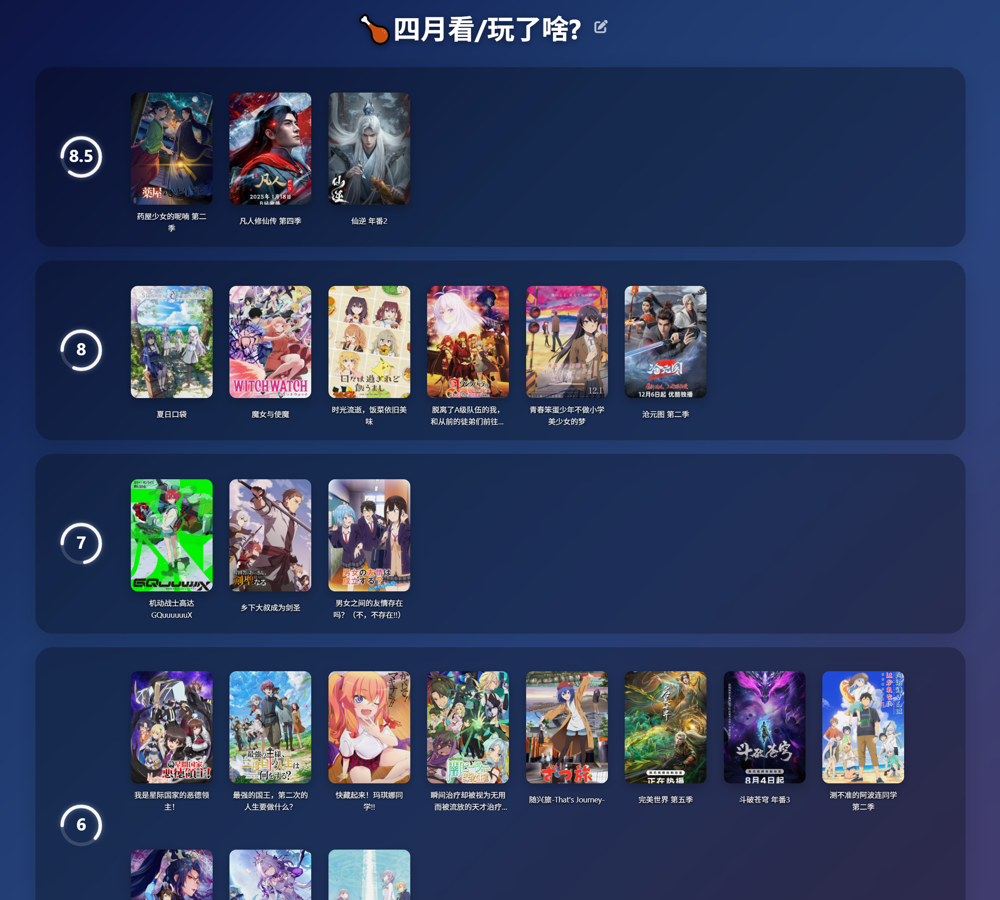
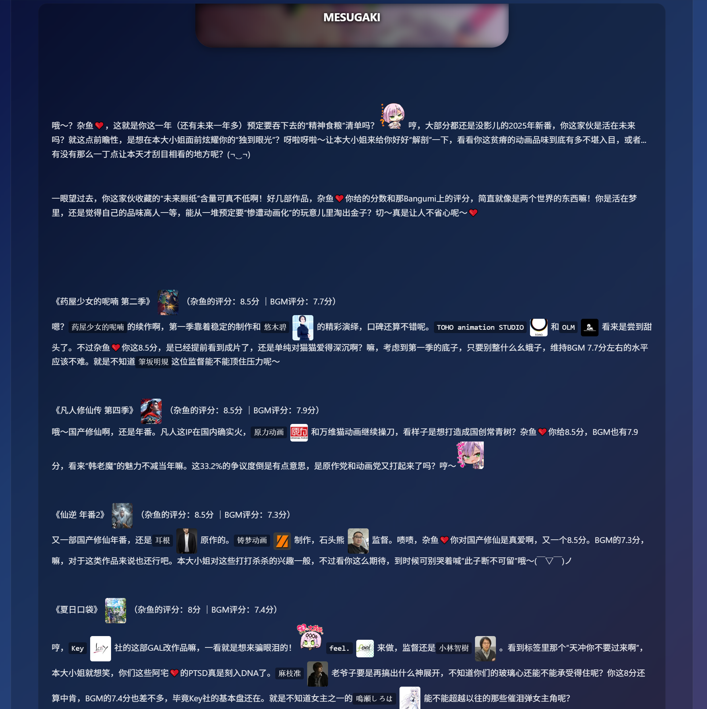
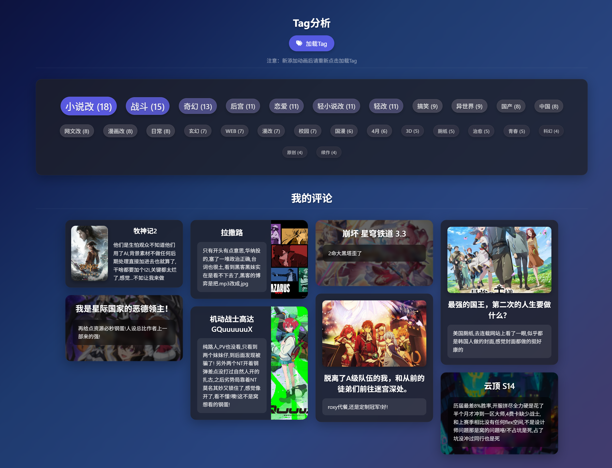
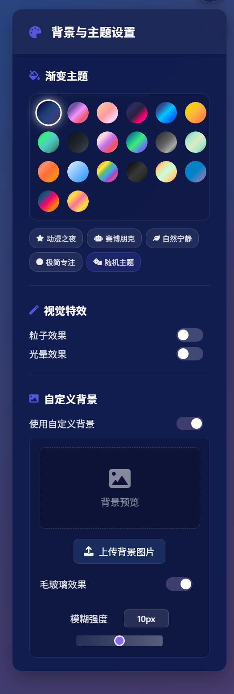

# BGM AniTier - 动画 Tier List 排行工具

一个不简洁的网页工具，用于创建和管理您的个人动画 Tier List 排行榜。

## 如何使用

1.  点击页面右上角绿色的 `Code` 按钮
2.  选择 Download ZIP
3.  下载完成后解压缩文件夹
4.  在您的网页浏览器中打开 `my-tier-list.html` 文件
5.  AI功能：如需使用AI分析功能，请准备 Google Gemini API Key

### 方法二：下载发行版（推荐）
1. 访问 [Releases 页面](https://github.com/yourusername/BGM-AniTier/releases)
2. 下载最新版本的压缩包
3. 解压缩到任意文件夹
4. 双击打开 `my-tier-list.html` 文件
5. 开始创建您的动画排行榜！

### 在线使用

访问：[项目 GitHub Pages](https://dsgrou.dpdns.org/my-tier-list)

## 主要功能

-   从 Bangumi 搜索动画或按季度浏览。
-   通过拖拽对动画进行分级。
-   自定义 Tier 等级和外观。
-   添加个人评论。
-   将您的 Tier List 导出为图片或 JSON 数据。
-   **AI 总结报告（LLM 功能）**：利用 Google Gemini AI 分析您的动画偏好并生成个性化的“品味总结报告”。您可以选择不同的 AI 角色（如毒舌雌小鬼、可爱猫娘等）来获得不同风格的趣味点评。此功能需要您自行提供有效的 Gemini API Key。

## 注意
-   页面全是bug,不要依赖导出数据来保存,可能会丢失,建议截图保存
-   如果想评论的话建议不要评论自定义内容,数据会溢出导致保存失败
-   导出数据的时候,自定义图片可能也会丢失哦
-   我只测试过windows+chrome能正常运行,其他的环境没测哇

## 效果截图

下面展示了工具的一些主要界面和功能：

Tier List 主界面，可以拖拽动画进行分级

 

AI总结报告。

 

 

## 技术栈

-   HTML, CSS, JavaScript

## 主要依赖库

-   **SortableJS**: 用于实现拖拽排序功能。
-   **html2canvas**: 用于将 Tier List 导出为图片。
-   **Masonry**: 用于评论区的瀑布流布局。
-   **Font Awesome**: 提供图标。
-   **Marked**: 用于渲染 Markdown 格式的评论和说明。
-   **Highlight.js**: 用于代码高亮。
-   **@google/generative-ai**: 用于实现 AI 总结报告功能。

## 🙏 致谢

-   **动画数据来源**：[番组计划 (Bangumi)](https://bgm.tv/) - 感谢提供丰富的动画数据库
-   **搜索功能参考**：[anime-grid](https://github.com/itorr/anime-grid) - 动画生涯个人喜好表生成器
-   **图标资源**：[Font Awesome](https://fontawesome.com/) - 精美的图标库

## ⚖️ 使用声明

-   ✅ **个人使用**：完全免费，欢迎个人学习和使用
-   ❌ **商业用途**：禁止用于商业、盈利用途
-   📝 **开源协议**：本项目采用 MIT 协议开源
-   🔗 **数据来源**：动画信息来自番组计划，请遵守其使用条款
